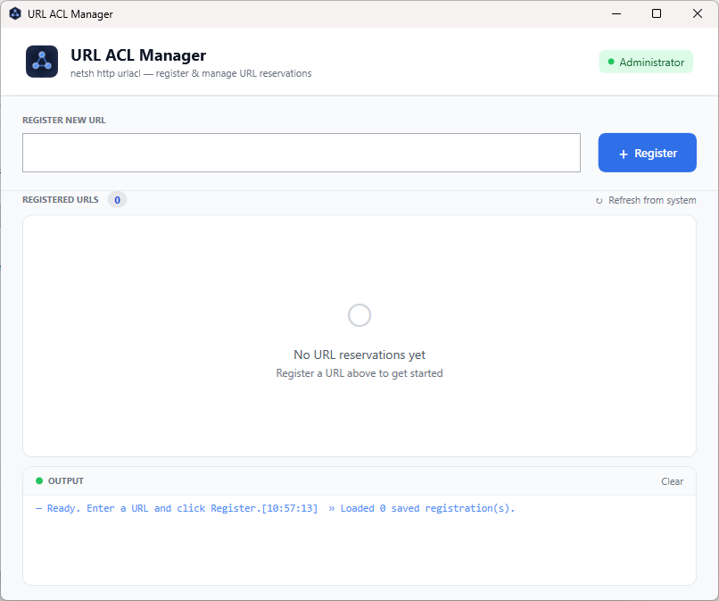

# URL ACL Manager

A small Windows desktop utility for managing HTTP URL ACL reservations via `netsh http urlacl`.

This is a WPF application that makes it easier to add and remove URL reservations required by self-hosted HTTP services (for example, when using `HttpListener` or certain development tools).

## Features

- Visual list of your custom URL ACL registrations
- Add new URL reservations using `netsh http add urlacl`
- Remove existing reservations using `netsh http delete urlacl`
- Uses elevation (UAC) when required to perform changes
- Persists your own entries in a JSON file under your roaming profile
- Shows a colorized log of all operations and `netsh` output

## Requirements

- Windows (URL ACLs and `netsh http` are Windows-only)
- .NET (WPF desktop runtime; see project file for the exact target)
- Administrator rights are required to actually add/remove URL ACLs

## Usage

1. Start the `UrlAclRegistration` application.
2. Enter the URL you want to reserve, for example:
   - `http://+:5000/`
   - `http://localhost:1234/`
3. Click `Register`.
   - If the app is not already running elevated, Windows will show a UAC prompt when it needs to call `netsh`.
4. Existing entries appear in the Registered URLs list where you can:
   - Copy the URL
   - Remove the reservation (also via `netsh`)
5. Use `Refresh from system` to sync with the current `netsh http show urlacl` output and drop stale entries from the local list.

## Notes

- The app currently registers URLs for the `Everyone` group by default.
- If you cancel the UAC prompt, the operation is aborted and a message is shown in the log.
- Stored registrations are just a convenience cache for the UI; the real source of truth is the system `netsh http show urlacl` list.

## Building

Open `UrlAclManager.csproj` (or the containing solution if present) in Visual Studio and build the WPF project as usual. Run the app with `F5` or from the build output folder.

## Screenshot

Main window of the URL ACL Manager:

